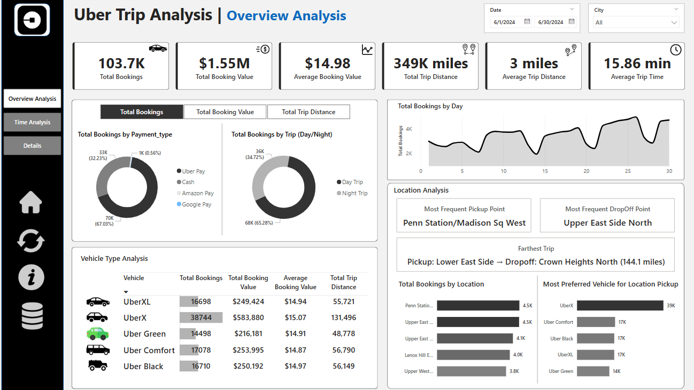
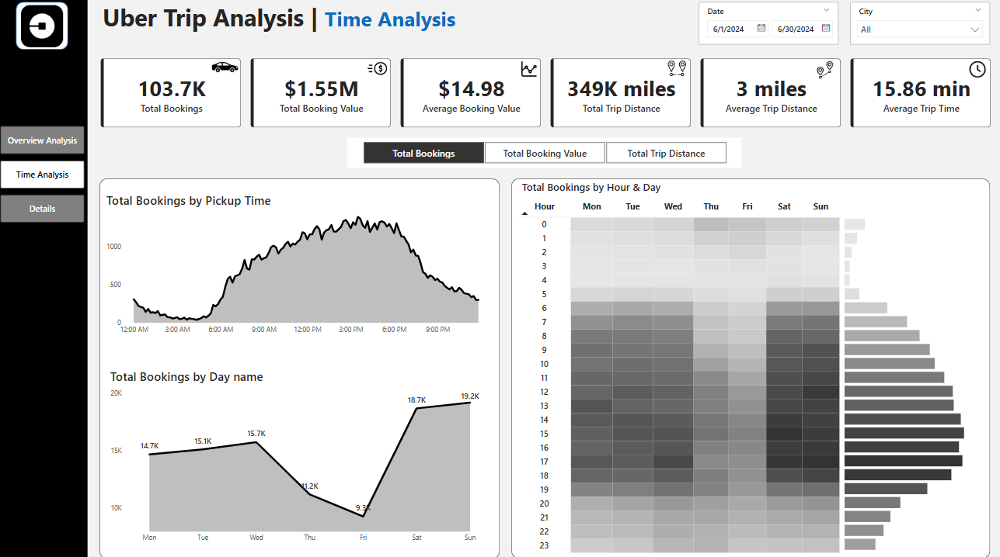

# 🚖 Uber Trip Analysis Dashboard (Power BI)

This project presents an interactive **Power BI dashboard** built to analyze Uber ride data for June 2024. It provides deep insights into trip timing, fare metrics, vehicle usage, payment patterns, and location-based trends. The dashboard enables stakeholders to explore ride patterns, peak hours, customer behavior, and operational efficiency in a highly visual and dynamic format.

---

## 📊 Dashboard Pages

### 1️⃣ Overview Analysis

This page provides an executive summary of Uber trip activity, with interactive tabs to switch between:

- **Total Bookings**
- **Total Booking Value**
- **Total Trip Distance**

Key visual elements:

- KPIs: Total Rides, Booking Value, Average Value, Trip Distance, Avg Trip Time
- Donut charts breaking down bookings by **Payment Type** and **Day/Night**
- Vehicle type summary: Bookings, Revenue, Avg Value, and Distance
- Most frequent **pickup and drop-off points**
- Longest recorded trip
- Dynamic bar charts showing:
  - **Total Bookings by Location**
  - **Most Preferred Vehicle for Pickup**

---

### 2️⃣ Time Analysis

This tab provides temporal analysis with toggle options for:

- **Total Bookings**
- **Booking Value**
- **Trip Distance**

Visual insights:

- Line graphs for:
  - Activity by **Pickup Hour**
  - Activity by **Day of Week**
- Heatmaps showing intensity of bookings by **Hour vs Weekday**
- Clear visibility into weekday vs weekend demand shifts

---

## 📁 Dataset Details

### 📌 Table – `Trip Details`

This table contains granular trip-level data including:

- **Trip ID** – Unique identifier for each Uber ride  
- **Pickup Time** – Date and time when the trip started  
- **Drop Off Time** – Date and time when the trip ended  
- **Passenger Count** – Number of passengers  
- **Trip Distance** – Miles traveled  
- **PULocationID** – Pickup location code  
- **DOLocationID** – Drop-off location code  
- **Payment Type** – Cash, card, wallet, etc.  
- **Fare Amount** – Base fare before additional fees  
- **Surge Fee** – Additional fee during peak demand  
- **Vehicle** – UberX, UberXL, Uber Black, etc.

---

### 📌 Table – `Location Table`

Maps numeric location IDs to area names:

- **LocationID** – Unique key for each location  
- **Location** – Name of the neighborhood or area  
- **City** - City name

Used to decode and analyze pickup/drop-off patterns.

---

## 💡 Key Insights

- 🏆 **UberX** dominates with over **38K rides** and **$583K+ in revenue**
- 💰 **Uber Pay** accounts for **70% of booking value** and **66% of total distance**
- 🌙 **Night Trips** make up **65% of rides**, with $975K in booking value and 211K miles traveled
- 📍 **Penn Station/Madison Sq West** is the most common pickup point  
- 🧭 **Upper East Side North** leads as the top drop-off destination
- 🛣️ Longest trip: **Lower East Side → Crown Heights North**, spanning **144.1 miles**
- 📈 Bookings spike between **3 PM – 6 PM**, especially on **Fridays and weekends**
- 🗓️ **Sunday and Saturday** have the highest total booking values, crossing **$275K**
- 📊 Heatmaps confirm that **late afternoon to early evening** is the busiest time block across days

---

## 🛠 Tools Used

- **Power BI Desktop**
- DAX for calculated columns and KPIs
- Drill-through, bookmarks, buttons, and slicers for interactivity
- Dynamic visuals with tab-like behavior for switching KPI context

---

## 👨‍💻 Author

_Chirag Pandey_  
– Email: chiragpandey0504@gmail.com  
– GitHub: [@chiragpandey0504](https://github.com/chiragpandey0504)
