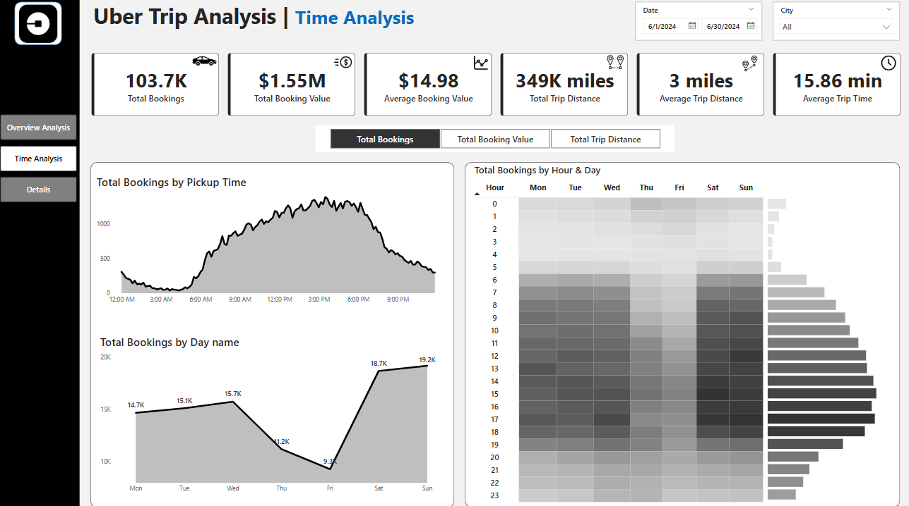

# 🚖 Uber Trip Analysis Dashboard (Power BI)

This project presents an interactive **Power BI dashboard** built to analyze Uber ride data for June 2024. It provides deep insights into trip timing, fare metrics, vehicle usage, and location-based trends. The dashboard enables stakeholders to explore ride patterns, peak hours, and customer preferences in a highly visual and intuitive format.

---

## 📊 Dashboard Pages

### 1️⃣ Overview Analysis

- Key KPIs: Total Bookings, Revenue, Trip Distance, Average Trip Time
- Breakdowns by Payment Type (e.g., Uber Pay, Cash, Wallet)
- Day vs Night Trip Comparison
- Vehicle Type Distribution
- Most Frequent Pickup and Drop-off Points
- Farthest Trip Route

---

### 2️⃣ Time Analysis

- Bookings by Hour of Day and Day of Week
- Heatmap showing booking density by Hour vs Weekday
- Booking Trends by Day Name
- Usage spikes and low-demand intervals clearly visualized

---

## 📁 Dataset Details

### 📌 Table – `Trip Details`

This table contains granular trip-level data including:

- **Trip ID** – Unique identifier for each Uber ride  
- **Pickup Time** – Date and time when the trip started  
- **Drop Off Time** – Date and time when the trip ended  
- **Passenger Count** – Number of passengers  
- **Trip Distance** – Miles traveled  
- **PULocationID** – Pickup location code  
- **DOLocationID** – Drop-off location code  
- **Payment Type** – Cash, card, wallet, etc.  
- **Fare Amount** – Base fare before additional fees  
- **Surge Fee** – Additional fee during peak demand  
- **Vehicle** – UberX, UberXL, Uber Black, etc.

---

### 📌 Table – `Location Table`

This reference table maps numeric location IDs to meaningful area names:

- **LocationID** – Unique key for each location  
- **Location** – Name of the neighborhood or area
- **City** – City Name

This mapping enables aggregation and analysis at the area level (pickup/drop-off trends).

---

## 💡 Key Insights

- 📈 **UberX leads the market** with nearly 39K bookings, followed by Uber Comfort and Uber Black.
- 🕒 **Peak activity observed between 8:00 AM – 6:00 PM**, especially on weekdays.
- 📍 **Penn Station/Madison Sq West** is the most frequent pickup point, while **Upper East Side North** dominates drop-offs.
- 🌙 **Night Trips (post 5 PM and before 6 AM)** account for 65% of rides, indicating strong late-hour demand.
- 🗓️ **Weekend bookings (especially Saturday and Sunday)** are significantly higher, peaking above 19K on Sundays.
- 📊 **Payment via Uber Pay dominates** with 67% share, followed by Cash (32%).
- 🛣️ The **longest trip** was from **Lower East Side → Crown Heights North**, spanning **144.1 miles**.
- 🔥 The **booking heatmap** shows strong early morning and evening demand during weekends, with lighter activity during late-night weekday hours.

---

## 🛠 Tools Used

- **Power BI Desktop**
- DAX for calculated columns and KPIs  
- Interactive visuals using slicers and drill-through  
- Bookmarks and dynamic titles for UX enhancement

---

## 📎 Author

_Chirag Pandey_  
– Email: chiragpandey0504@gmail.com  
– GitHub: [@chiragpandey0504](https://github.com/chiragpandey0504)
